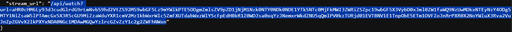
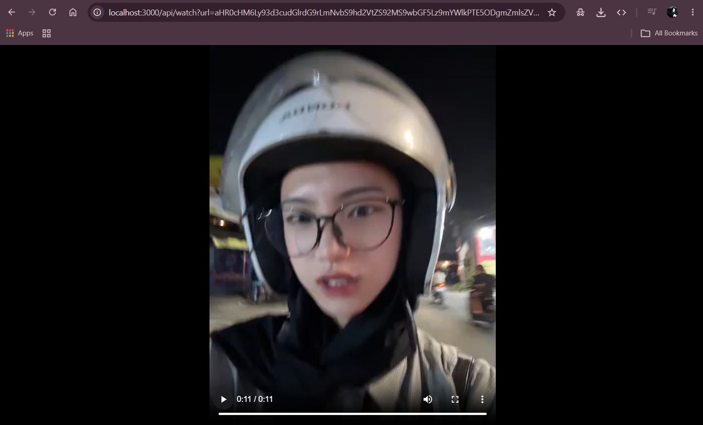

# TikTok Downloader

A simple TikTok video downloader built with **Node.js** and **Express**.  
This project does **not** use any third-party TikTok API. It reads the video metadata directly from the TikTok page and provides a video stream endpoint.

- Demo website: https://taketik.cloud

## Features

- [x] No third-party API
- [x] Simple JSON response
- [x] Standard Video Link and Download
- [ ] Download Tiktok Story
- [ ] Search Video and Download
- [x] Download Image Carousel 
- [x] Built with Express, Axios, Puppeteer and Cheerio

## Installation

```bash
git clone https://github.com/frenzy8/tt-dl.git
cd tt-dl
npm install
```

## Run

```bash
node index
```

Server will start at:

```
http://localhost:3000
```

---

### 1. GET VIDEO METADATA

**Request**

```http
GET /api/download?url=https://www.tiktok.com/@username/video/123456789
```

**Example**

```bash
curl "http://localhost:3000/api/download?url=https://www.tiktok.com/@username/video/123456789"
```

**Response for Video**

```json
{
  "success": false,
  "message": "",
  "id": "",
  "desc": "",
  "createTime": "",
  "scheduleTime": 0,
  "video": {
    "id": "",
    "height": 0,
    "width": 0,
    "duration": 0,
    "ratio": "",
    "dynamicCover": "",
    "shareCover": [],
    "reflowCover": "",
    "bitrate": 0,
    "encodedType": "",
    "format": "",
    "videoQuality": "",
    "encodeUserTag": "",
    "codecType": "",
    "definition": "",
    "subtitleInfos": [],
    "volumeInfo": {
      "Loudness": 0,
      "Peak": 0
    },
    "size": "",
    "VQScore": "",
    "claInfo": {
      "hasOriginalAudio": false,
      "enableAutoCaption": false,
      "captionInfos": [],
      "noCaptionReason": 0
    },
    "videoID": "",
    "PlayAddrStruct": {
      "DataSize": "",
      "Width": 0,
      "Height": 0,
      "Uri": "",
      "UrlList": [],
      "UrlKey": "",
      "FileHash": "",
      "FileCs": ""
    }
  },
  "author": {
    "id": "",
    "shortId": "",
    "uniqueId": "",
    "nickname": "",
    "avatarLarger": "",
    "avatarMedium": "",
    "avatarThumb": "",
    "signature": "",
    "createTime": 0,
    "verified": false,
    "secUid": "",
    "ftc": false,
    "relation": 0,
    "openFavorite": false,
    "commentSetting": 0,
    "duetSetting": 0,
    "stitchSetting": 0,
    "privateAccount": false,
    "secret": false,
    "isADVirtual": false,
    "roomId": "",
    "uniqueIdModifyTime": 0,
    "ttSeller": false,
    "downloadSetting": 0,
    "recommendReason": "",
    "nowInvitationCardUrl": "",
    "nickNameModifyTime": 0,
    "isEmbedBanned": false,
    "canExpPlaylist": false,
    "suggestAccountBind": false,
    "UserStoryStatus": 0,
    "shortDramaCreator": {}
  },
  "music": {
    "id": "",
    "title": "",
    "playUrl": "",
    "coverLarge": "",
    "coverMedium": "",
    "coverThumb": "",
    "authorName": "",
    "original": false,
    "private": false,
    "duration": 0,
    "scheduleSearchTime": 0,
    "collected": false,
    "preciseDuration": {
      "preciseDuration": 0,
      "preciseShootDuration": 0,
      "preciseAuditionDuration": 0,
      "preciseVideoDuration": 0
    },
    "isCopyrighted": false,
    "tt2dsp": {
      "tt_to_dsp_song_infos": []
    },
    "is_unlimited_music": false,
    "is_commerce_music": false,
    "shoot_duration": 0
  },
  "challenges": [],
  "stats": {
    "diggCount": 0,
    "shareCount": 0,
    "commentCount": 0,
    "playCount": 0,
    "collectCount": ""
  },
  "statsV2": {
    "diggCount": "",
    "shareCount": "",
    "commentCount": "",
    "playCount": "",
    "collectCount": "",
    "repostCount": ""
  },
  "warnInfo": [],
  "originalItem": false,
  "officalItem": false,
  "textExtra": [],
  "secret": false,
  "forFriend": false,
  "digged": false,
  "itemCommentStatus": 0,
  "takeDown": 0,
  "effectStickers": [],
  "authorStats": {
    "followerCount": 0,
    "followingCount": 0,
    "heart": 0,
    "heartCount": 0,
    "videoCount": 0,
    "diggCount": 0,
    "friendCount": 0
  },
  "privateItem": false,
  "duetEnabled": false,
  "stitchEnabled": false,
  "stickersOnItem": [],
  "isAd": false,
  "shareEnabled": false,
  "comments": [],
  "duetDisplay": 0,
  "stitchDisplay": 0,
  "indexEnabled": false,
  "diversificationLabels": [],
  "locationCreated": "",
  "suggestedWords": [],
  "contents": [],
  "diversificationId": 0,
  "collected": false,
  "channelTags": [],
  "item_control": {
    "can_repost": false
  },
  "IsAigc": false,
  "AIGCDescription": "",
  "ShowAIGC": false,
  "backendSourceEventTracking": "",
  "CategoryType": 0,
  "textLanguage": "",
  "textTranslatable": false,
  "authorStatsV2": {
    "followerCount": "",
    "followingCount": "",
    "heart": "",
    "heartCount": "",
    "videoCount": "",
    "diggCount": "",
    "friendCount": ""
  },
  "isReviewing": false,
  "creatorAIComment": {
    "hasAITopic": false,
    "categoryList": [],
    "eligibleVideo": false,
    "notEligibleReason": 0
  },
  "stream_url": "/api/watch?url=TOKEN"
}
```

---

### 2. GET MP4 RESULT

Use the `stream_url` returned from `/api/download`.


**Request**

```http
GET /api/watch?url=TOKEN
```

**Example**

```bash
curl -o video.mp4 "http://localhost:3000/api/watch?url=TOKEN"
```

This endpoint returns the video as an `mp4` stream.


---
